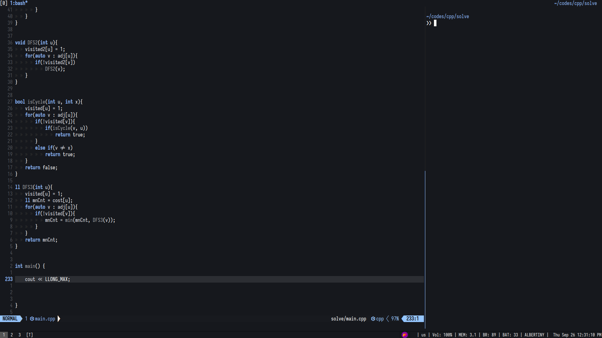

- My Neovim Config



```
# Dir structure
```bash
├── init.lua
├── lua
    ├── commands.lua
    ├── mappings.lua
    ├── options.lua
    └── plugins
        ├── init.lua
        ├── configs
            ├── cmp.lua
            ├── telescope.lua
            └── ( more ... )
```
